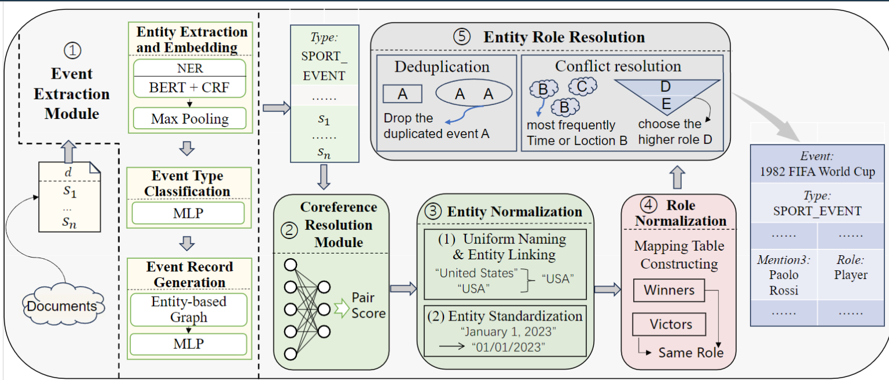

# CLES
- project for paper "Harvesting Events from Multiple Sources: Towards a Cross-Document Extraction Paradigm"

## 1. The process of collecting the CLES dataset involved several steps:

  1. Firstly, we gather document-level event data from Wikipedia. The original dataset is located in "dataset/document_level_dataset".
  2. Secondly, we extract events from the documents using OmniEvent as our tool to obtain the raw dataset.
  3. We utilize human validation to obtain the final dataset, as described in the paper.

## 2. CDEE model

